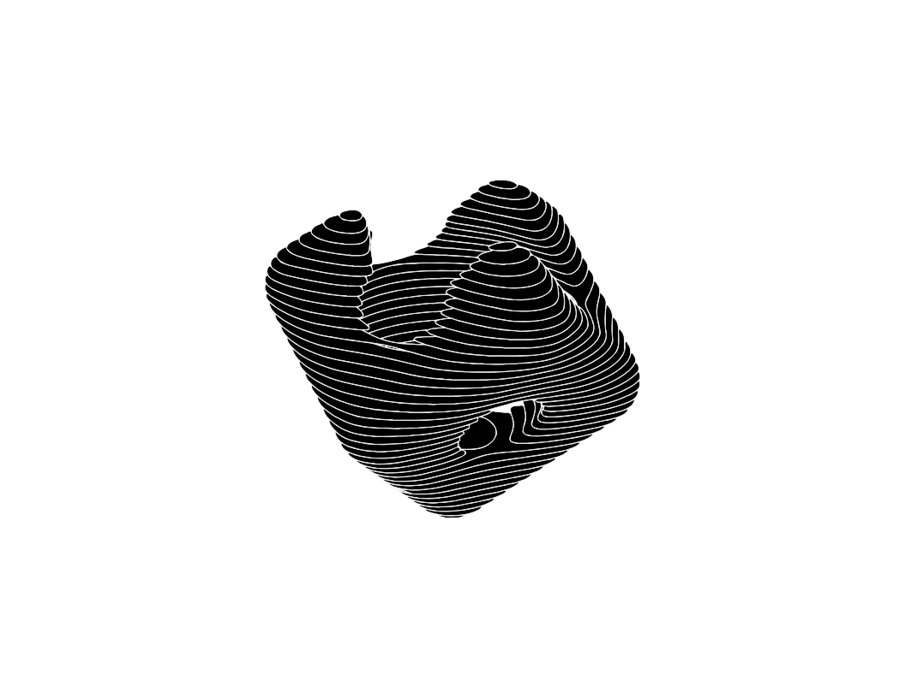

# SDFx
A Signed Distance Field art tool built with Clojure, WebGL, and HTMX.

Signed Distance Fields and the operations you can perform on them allow you to create complex and cool shapes which make for really cool art pieces; particularly if you can plot them with a pen plotter (I'm partial to AxiDraw). To that end, I've made this tool to make it fun and easy to build SDFs.

## Getting Started
Since this is a tool for me, I'm not too fussed about distribution. However, it's actually pretty easy to get started.

0. If you're comfortable with Clojure, you can do the following:
 - `git clone https://github.com/adam-james-v/sdfx.git`
 - `cd sdfx`
 - `clojure -T:build uber` which should build the uberjar `target/SDFx-0.0.1.jar`
 - run SDFx with `java -jar target/SDFx-0.0.1.jar`. This command will start the server and print the port it's using.
 - Head to `localhost:THE_PORT_SPECIFIED` and have fun!
